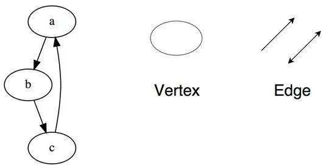

# 数据结构

数据结构是以某种特定的布局方式存储数据的容器。这种“布局方式”决定了数据结构对于某些操作是高效的，而对于其他操作则是低效的。首先我们需要理解各种数据结构，才能在处理实际问题时选取最合适的数据结构。

------

## 1.数组 Array

数组是可以再内存中连续存储多个元素的结构，在内存中的分配也是连续的，数组中的元素通过数组下标进行访问，数组下标从0开始。

数组是最简单、也是使用最广泛的数据结构。栈、队列等其他数据结构均由数组演变而来。

#### 操作：

- Insert (idx, val) ——在指定索引位置插入一个元素
- Get (idx) ——返回指定索引位置的元素
- Delete (idx) ——删除指定索引位置的元素
- Size——得到数组所有元素的数量

#### 优点：

1. 按照索引查询元素速度快 
2. 按照索引遍历数组方便

#### 缺点：

1. 数组的大小固定后就无法扩容了 
2. 数组只能存储一种类型的数据 
3. 添加，删除的操作慢，因为要移动其他的元素。

#### 适用场景：

频繁查询，对存储空间要求不大，很少增加和删除的情况

## 2. 栈 Stack

栈是一种只允许在栈顶的一端进行操作的链表/数组.

工作原理是后进先出（LIFO - Last In First Out）

#### 操作：

- Push (val) ——将一个元素压入栈顶
- Pop () ——移除栈顶元素并返回

## 3. 队列 Queue

队列是这样的的链表/数组：只允许在尾部进行插入，头部进行弹出。

工作原理是先进先出（FIFO - First In First Out）

#### 操作：

- Enqueue (val)——在队列尾部插入元素
- Dequeue ()——移除队列头部的元素

## 4. 链表 Linked List

链表是物理存储单元上非连续的、非顺序的存储结构，数据元素的逻辑顺序是通过链表的指针地址实现，每个元素包含两个结点，一个是存储元素的数据域 (内存空间)，另一个是指向下一个结点地址的指针域。指向第一个元素的链称为表头。

根据指针的指向，链表能形成不同的结构，例如单向链表，双向链表，循环链表，循环双向链表等。 

#### 优点： 

- 不需要初始化容量，可以任意加减元素； 
- 添加或者删除元素时只需要改变前后两个元素结点的指针域指向地址即可，所以添加，删除很快；

#### 缺点： 

- 因为含有大量的指针域，占用空间较大；
- 查找元素需要遍历链表来查找，非常耗时。

#### 适用场景： 

数据量较小，需要频繁增加，删除操作的场景

## 5. 图 Graph

图是一组以网络形式相互连接的节点。节点也称为顶点。 一对节点（x，y）称为边（edge），表示顶点x连接到顶点y。边可以包含权重/成本，显示从顶点x到y所需的成本。

图可分为无向图和有向图。

#### 与图有关的一些属性：

1. **度（degree）**：无向图中顶点的度是与它邻接的顶点的个数，有向图中分为出度和入度
2. **路径的长度**：路径中边的数目
3. **连通图**：如果每个顶点从其他顶点出发都是可到达的，那么这个图是连通的
4. **完全图**：如果每个顶点到其他顶点之间都有一条边，那么这个图是完全图

#### 图的表示方法：

1. 邻接矩阵：M[i,j]=1，表示($v_i$,$v_j$)是G中的一条边
2. 邻接表：一个顶点的所有邻接顶点用一个链表来表示

## 6. 树 Tree

树是不包含回路的连通无向图。一个森林是顶点不相交的树的集合。

如果T是有n个顶点的树，那么：

1. T中任意两个顶点有唯一的一条路径连通
2. T中恰有n-1条边
3. 在T中加入一条边将构成一条回路

### （1）根树

根树T是一颗带有一个特殊顶点的树，顶点r是T的**根节点**。没有子节点的顶点称为**叶子节点**，其他所有节点称为**内部节点**。

- **深度**：根树中顶点v的深度是从根节点到v的路径的长度
- **高度**：顶点v的高度定义为从v到叶子节点的最长路径的长度。树的高度就是根节点的高度
- **树的遍历**：前序遍历（root-左-右），中序遍历（左-root-右），后序遍历（左-右-root）（前中后可理解为root的位置）

### （2）二叉树

二叉树是节点的一个有限集合，集合或者为空，或有一个根节点r和左右子树（子树也是二叉树）组成。二叉树的左右子树有严格区别，不能颠倒。

- **满二叉树**：所有内部节点都有两个儿子
- **完全二叉树**：所有叶子都有相同深度（在同一层）的满二叉树。有n个顶点的完全二叉树可以用数组A[1...n]表示，A[j]的左右儿子分别为A[2j]和A[2j+1]，A[i]的父亲为A[i/2]
- **二叉搜索树**：所有存储在顶点v的左子树中的元素都小于存储在v中的元素，所有存储在顶点v的右子树中的元素都大于存储在v中的元素。用二叉搜索树来表示一个集合的结果不是唯一的。

二叉树是一种比较有用的折中方案，它添加，删除元素都很快，并且在查找方面也有很多的算法优化，所以，二叉树既有链表的好处，也有数组的好处，是两者的优化方案，在处理大批量的动态数据方面非常有用。

## 7.堆 Heap

一个（二叉）堆是一个几乎完全的二叉树，它的每个节点都满足堆的特性：用p(v)表示v的父节点，则p(v)的值不小于v的值

可以用一个**数组H[1..n]**表示堆，其中H[i]>=H[2i]，H[i]>=H[2i+1]

#### 操作：

- DeleteMax(H)：从堆H中删除最大值并返回
- Insert(H, val)：插入值到堆H中
- Delete(H, idx)：从堆H中删除某一项
- MakeHeap(A)：将数组A转换成堆H

#### 堆上的运算：

- SiftUp：沿着从H[i]到H[1]的路径，比较节点和其父节点的大小，不满足堆特性就进行交换
- SiftDown：沿着从H[i]到叶子节点的路径，比较节点和其两个子节点的大小，不满足堆特性就与更大的子节点进行交换

#### 堆操作实现：

- Insert(H, val)：将val放到H的末尾，然后SiftUp
- Delete(H, idx)：将H[n]放到H[idx]处，将H大小减一；若H[n]比H[idx]大，SiftUp，反之则SiftDown
- DeleteMax(H)：等同于删除根节点
- MakeHeap(A)：法1：遍历A依次insert（H，A[i]）,复杂度为O(nlogn)；**法2**：直接把A当作一个待校正的堆，遍历A[n/2]到A[1]逐个SiftDown，复杂度为O(n)

#### 运用：

堆排序，实现优先队列

## 8.不相交集 Disjoint Set

给出一个有n个不同元素的集合S，这些元素被分成不相交的集合，每个子集用内部的一个元素作为集合的名字。

这样的结构可以被看作是根树，每个子集是一棵树，名字元素就是根节点，其他元素是儿子，孙子...，所有子集形成一个森林

#### 操作：

- Find(val)：寻找包含元素val的集合的名字
- Union(x, y)：合并包含元素x和y的两个子集，合并后的名字可以是两个子集中任意一个的名字

可以使用一个数组**A[1...n]**来表示不相交集，A[i]是元素i的父节点值，A[j]为0表示j是集合根节点，j就是集合名称。

显然Find可以通过遍历A[i]，A[A[i]]，……直到根节点，然后返回集合名称

Union可以直接将root(x)变成root(y)的子节点，但是这样可能会造成树不平衡，使后续Find变慢，因此提出两种优化措施：

#### （1）按秩合并

为每个节点额外存储一个值秩rank，rank可看作是节点的高度。

设x和y是两个集合的根：

1. rank(x) != rank(y)：rank小的节点变成另一个的子节点
2. rank(x) == rank(y)：指定x变成y的子节点，rank(y)加一

按秩合并生成的树比较平衡，k个节点的树高度至多为log k

#### （2）路径压缩

在Find操作中，找到root(x)后，遍历x到root(x)，将路径中每个点的父节点改成root(x)。

路径压缩增加了Find的工作量，但是缩短了后续的Find需要遍历的路径